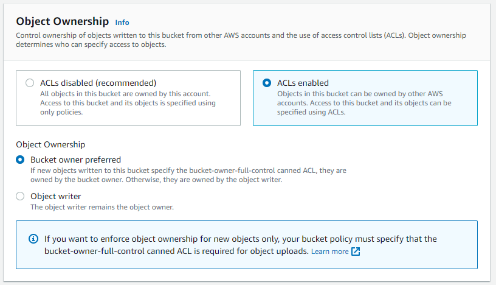
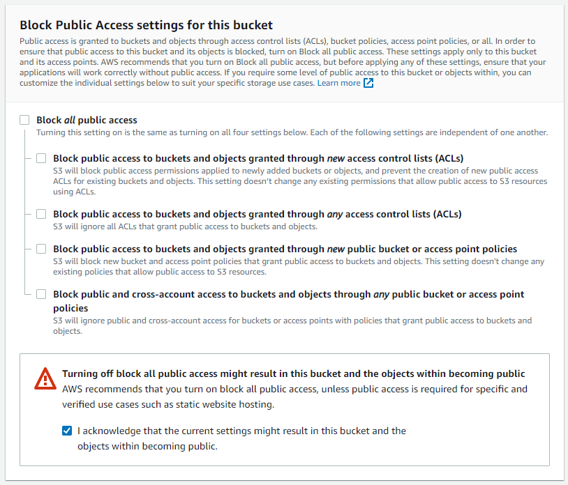
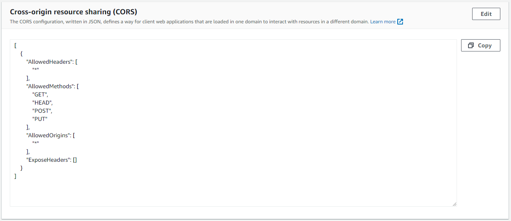
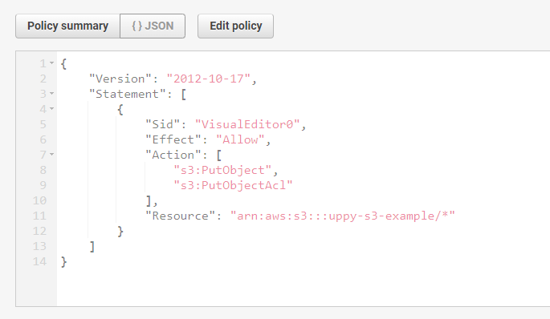

# Uppy + AWS S3 with Node.JS

A simple and fully working example of Uppy and AWS S3 storage with Node.js (and Express.js) It uses presigned URL at the backend level.

This README file starts with AWS as this one need to be resolved first.

# AWS Configuration

It's assumed that you are familiar with AWS, at least, with the storage service (S3) and users & policies (IAM).

These instructions are not fit for production. It's a bit too much permissive. But tightening the security is out of the scope here.

## S3 Setup

- Create new S3 bucket in AWS
- You need to enable ACLs on the bucket.
- Make the S3 bucket public
- Add CORS configuration.

## AWS Credentials

You may use existing AWS credentials or create a new user in the IAM page.

- Make sure you setup the AWS credentials properly and write down the Access Key ID and Secret Access Key.
- You may configure AWS S3 credentials using [environment variables](https://docs.aws.amazon.com/sdk-for-javascript/v3/developer-guide/loading-node-credentials-environment.html) or a [credentials file in `~/.aws/credentials`](https://docs.aws.amazon.com/sdk-for-javascript/v3/developer-guide/setting-credentials-node.html).
- You will need at least `PutObject` and `PutObjectAcl` permissions.

# Install

Download this code or clone repository into a folder and install dependencies:

```bash
corepack yarn install
```

Add a .env file to the directory and define the S3 bucket name and port variables like the example below:

```
S3_BUCKET=uppy-s3-example
PORT=8080
```

# Enjoy it

Start the application:

```bash
corepack yarn workspace @uppy-example/uppy-s3-example start
```

Dashboard demo should now be available at http://localhost:8080.

You have also a Drag & Drop demo on http://localhost:8080/drag

*Feel free to check how the demo works and feel free to open an issue.*
